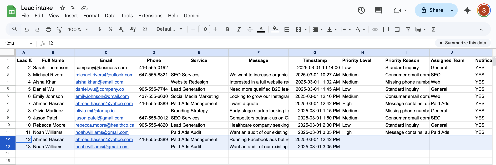
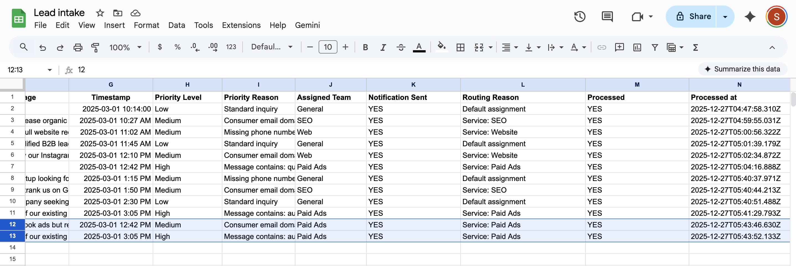
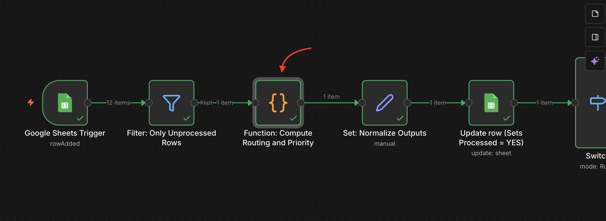
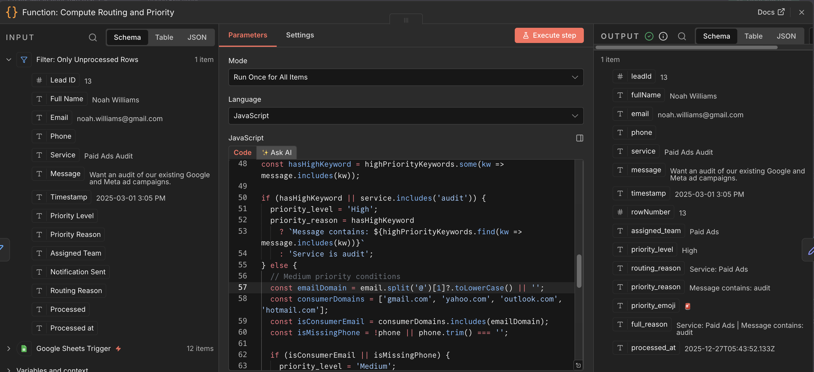

# 🚦 Lead Routing & Priority Assignment System

A production-ready automation built in **n8n** that assigns **exactly one team** and **one priority level** to every incoming lead — then logs the decision back to the source of truth.

The system replaces manual lead triage with deterministic, rule-based routing that runs automatically and leaves a clear audit trail.

  

---

## ❌ Problem

Manual lead routing created inconsistency and operational risk:

- ⏳ Leads waited to be noticed  
- 🚨 Urgent inquiries were mixed with low-intent messages  
- 🤷 Routing decisions depended on who saw the lead first  
- ❓ No record existed explaining *why* a lead was assigned a certain way  

Routing logic lived in people’s heads instead of a system.

  

---

## ✅ Solution

A single-path routing engine that:

- 🔍 Evaluates each lead once  
- 🎯 Assigns **one team** and **one priority**  
- 🧾 Writes decisions back to the same Google Sheets row  
- 🔒 Prevents duplicate processing or notifications  

All decisions are computed first, then executed once.  
No parallel branches. No conflicting actions.

  

---

## ⚙️ How the System Works

At a high level, the workflow follows a **compute → act** pattern:

1. 📥 A new lead is added to Google Sheets  
2. ⚡ n8n triggers on the new row  
3. 🧠 A JavaScript Function node computes:
   - `assigned_team`
   - `priority_level`
   - `routing_reason`
4. 📝 Results are written back to the same row  
5. 🔔 Notifications are sent downstream  

This structure keeps the workflow predictable and easy to change later.

  

  

---

## 🧰 Tech Stack

- ⚙️ **n8n** — workflow orchestration  
- 🧠 **JavaScript** — routing and priority logic  
- 📊 **Google Sheets** — intake and system of record  
- 💬 **Slack** — team notifications  

---

## 🧭 Decision Logic (Summary)

### 🏷️ Team Assignment
Based on keywords in **Service Interest**:

- “Paid Ads” → Paid Ads  
- “SEO” → SEO  
- “Website” → Web  
- “Social” → Social  
- No match → General (fallback)  

---

### 🚦 Priority Assignment
Evaluated in order:

**🔴 High**
- Message contains buying signals (`pricing`, `quote`, `audit`, `budget`)
- OR service selected is an audit  

**🟡 Medium**
- Free email domain (Gmail, Yahoo, Outlook, Hotmail)
- OR missing phone number  

**🟢 Low**
- All other cases  

Each lead resolves to **one clear outcome**.

---

## 📈 Outcome

- ⚡ Leads are routed within seconds  
- 🚨 High-intent leads are clearly flagged  
- ❌ No duplicate assignments or notifications  
- 🔍 Every decision is logged and reviewable  

The same input always produces the same result.

---

## ✅ Success Criteria

- One execution per lead  
- One assigned team per lead  
- One priority per lead  
- Decision written back to the source sheet  
- Safe fallback for incomplete or unexpected data  

---

## 🧪 Edge Cases Considered

- Missing service interest  
- Missing phone number  
- Consumer email domains  
- Messages without keywords  
- New or unexpected service values  
- Duplicate workflow triggers  

All cases resolve safely without manual intervention.

---

The system is designed so notifications (Slack, email, CRM sync, AI scoring) can be added **after** the decision step without breaking single-path execution.
